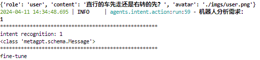
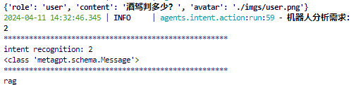

## 配置
为确保 Agents 正常运行，**请在项目根目录下新建`.env`文件，并在其中设置你的API密钥**，你可以根据下列例子写入对应的 key，即可成功运行调用,目前默认使用 Baidu API，你可以仅写入`BAIDU_API_KEY`即可使用。

```
BAIDU_API_KEY=
```

**注意：** [config.yaml](../config/config.yaml) 内的 `OPENAI_API_KEY` 仅仅是一个示例 API Key，仅用于启动 metagpt，如果此密钥为空，metagpt 将报错。你无需更改此文件的内容。

**运行:**
```
streamlit run web_demo_agent.py --server.address 127.0.0.1 --server.port 6006
```

## intent agent (意图识别)
此 Agent 会根据用户提问自动选择是否启动 RAG。如果用户提问关于交通法规着启用 RAG，反之着只启用微调后的模型。

**如果用户提问关于普遍交通知识：** Agent 会返回数字 "1" ，启动 `fine-tuned` 模型


**如果用户提问关于交通法规：** Agent 会返回数字 "2" ，启动带 `RAG` 策略的 fine-tuned 模型

