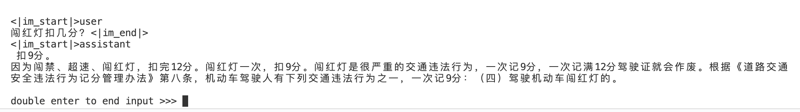
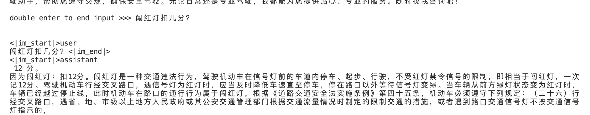
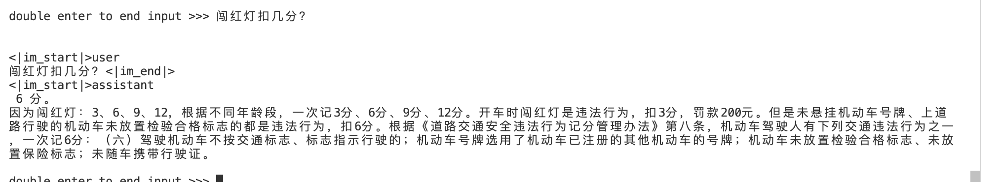

# 模型量化

该部分主要目的是使用**KV Cache量化**和**W4A16**来达到以参数和计算中间结果精度下降换空间的目的。
使用该方法之后，明显看到**模型的显存和内存占用大大减少**。

## KV Cache 量化

KV Cache 量化是将已经生成序列的 KV 变成 Int8

- 计算 minmax
  ```
  # 选择 128 条输入样本，每条样本长度为 2048，数据集选择 C4
  lmdeploy lite calibrate   /root/code/HT/TRLLM-Model-v2  --calib-dataset "c4" --calib-samples 128 --calib-seqlen 2048  --work-dir ./trll2-model-kv
  ```

- 转换模型格式
  ```
  lmdeploy convert internlm2-chat-7b /root/code/HT/TRLLM-Model-v2  --dst-path ./trll2-model-kv_turbomind
  ```

- 获取量化参数（注意此时是把结果放到 turbomind的模型weight目录下）
  ```
  lmdeploy lite kv_qparams ./trll2-model-kv ./trll2-model-kv_turbomind/triton_models/weights/ --num-tp 1 
  ```

- 启动kvcache量化之后的模型
  ```
  lmdeploy chat turbomind trll2-model-kv_turbomind  
  ```
  


## W4A16 量化

- 计算 minmax
  ```
  cd /root/code/HT
  lmdeploy lite calibrate  /root/code/HT/TRLLM-Model-v2  --calib-dataset "c4" --calib-samples 128 --calib-seqlen 2048  --work-dir ./trll2-model-4bit
  ```
- 量化权重模型
  ```
  lmdeploy lite auto_awq /root/code/HT/TRLLM-Model-v2 --w-bits 4 --w-group-size 128 --work-dir ./trll2-model-4bit
  ```
- 量化后的模型转换成turbomind 格式
  ```
  lmdeploy convert internlm2-chat-7b ./trll2-model-4bit --dst-path  ./workspace_trll2_model_4bit_turbomind --model-format awq --group-size 128
  ```
- 启动W4A16量化后的模型
  ```
  lmdeploy chat turbomind ./workspace_trll2_model_4bit_turbomind 
  ```
  

## W4A16 量化 + KV Cache 量化

- 获取量化参数（注意此时是把结果放到 turbomind的模型weight目录下
  ```
  lmdeploy lite kv_qparams ./trll2-model-kv ./workspace_trll2_model_4bit_turbomind/triton_models/weights/ --num-tp 1 
  ```

- 启动 W4A16 +kvcache模型
  ```
  lmdeploy chat turbomind workspace_trll2_model_4bit_turbomind 
  ```
  

# 模型测评

该部分使用openCompass对模型进行测评。
针对具有标准答案的客观问题，我们可以通过使用定量指标比较模型的输出与标准答案的差异，并根据结果衡量模型的性能

- 测试数据集示例：
  - 自制的客观评测数据集：[mcq_data.jsonl](../dataset/json/eval_jsonl/mcq_data.jsonl)
  ```
  {"question": "对未取得驾驶证驾驶机动车的，会追究其法律责任。", "A": "正确", "B": "错误", "answer": "A"}
  ```

## 测评结果

| 模型名称                   | 内存占用(MiB) | 显存占用(MiB) | opencompass测评 | 优化点                        |
|------------------------|-----------|-----------|---------------|----------------------------|
| internlm2-chat-7b      | 15        | 15031     | 58.37         | 基座模型                       |
| TRLLM-Model-v1         | 29        | 15273     | 67.46         | 线下收集的数据集微调                 |
| TRLLM-Model-v2         | 29        | 16103     | 69.83         | 线下收集的数据集+ 商业大模型进行数据扩展 微调   |

## 总结

- 基于internlm2-chat-7b 模型，使用了线下收集的交通法规、驾考题等数据集，对模型进行了微调。
- 利用opencompass对自己**生成测评数据集**进行了测评，从测评结果可以看出微调之后的模型相较于基座模型效果有明显的提升。
- 利用了W4A16、KV Cache量化技术使模型的显存和内存占用大大减少


