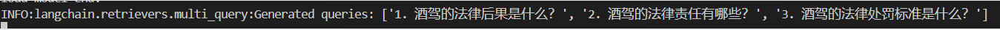

# RAG架构

上图展示了本项目采用的RAG架构。首先，通过提示方式，LLM将根据用户提问生成3个额外的相关问题（Multi Query Retriever）。总计4个问题将经过向量检索和关键词检索（Ensemble Retriever），检索到的文档将被返回给LLM，以便对用户提出的问题进行更详细的回答，尤其是在法规方面。这一设计旨在确保LLM的输出回答涵盖更多细节。

## 生成Prompt

上图显示了用于引导模型生成额外提问的提示方式。

上图展示了针对用户提问 “酒驾怎么罚？” 生成的额外3个提问。

## 结果对比

- **基于 internlm2-chat-7b 为基座模型对比 Ensemble Retriever 和 Multi Query Retriever**：
  
| Ensemble Retriver  | Multi Query Retriever |
|--------------------|-----------------------|
| [compare1-er.png](../assets/compare1-er.png) | [compare1-mqr.png](../assets/compare1-mqr.png)  |

经过对比发现，Multi Query Retriever相较于Ensemble Retriever更能输出详尽的法规细节。然而，这取决于Multi Query Retriever输出的额外提问。在额外提问偏离主题的情况下，Ensemble Retriever的性能可能更为出色。这强调了基座模型对prompt理解和关联相关提问的能力的重要性。实验证明，在某些情况下，7B模型生成的额外提问会偏离主题。

- **基于 TRLLM-v2 为基座模型对比 Ensemble Retriever 和 Multi Query Retriever**：

| TRLLM-v2 | TRLLM-v2 + Ensemble Retriver  | TRLLM-v2 + Multi Query Retriever |
| ------- |--------------------|-----------------------|
| [compare2-trllm-v2.png](../assets/compare2-trllm-v2.png) | [compare2-er.png](../assets/compare2-er.png) | [compare2-mqr.png](../assets/compare2-mqr.png)  |

[compare2-prompt.png](../assets/compare2-prompt.png) 

原生TRLLM-v2和使用Ensemble Retriever时的结果相似，而Multi Query Retriever在TRLLM-v2上能够提供一些额外信息，但整体差距不大。经过测试发现，TRLLM-v2的知识覆盖了RAG输出的知识，也就是说，当启用RAG时，如果用户提出的问题超出了 TRLLM-v2 的知识范围，但在 RAG 涵盖的领域内，模型也无法回答该问题。简言之，RAG的作用主要是为TRLLM-v2的输出添加一些细节（取决于输出额外提问的关联性以及多样性），有时甚至没有。此外，正如图中所示，TRLLM-v2存在不受prompt影响的情况，原本应该输出额外提问变成输出了答案。综上所述，TRLLM-v2可能存在过拟合的现象。

- **基于 TRLLM-v2-4bit（量化后的TRLLM-v2） 为基座模型对比 Ensemble Retriever 和 Multi Query Retriever**：

| TRLLM-v2-4bit | TRLLM-v2-4bit + Ensemble Retriver  | TRLLM-v2-4bit + Multi Query Retriever |
| ------- |--------------------|-----------------------|
| [compare3-trllm.png](../assets/compare3-trllm.png) | [compare3-er.png](../assets/compare3-er.png) | [compare3-mqr.png](../assets/compare3-mqr.png)  |

量化后的模型的效果差了不少，知识覆盖的情况也没有改善。

## 总结

如何想询问跟交通法规相关的建议使用基于 internlm2-chat-7b 为基座模型的 Ensemble Retriever，这是因为rag数据集收集了相对全面的法规，而且微调后的模型存在知识覆盖的情况。反之如果想询问驾考方面推荐使用 TRLLM-v2 + Multi Query Retriever。

