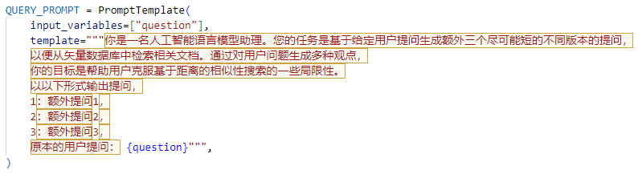

# RAG架构

上图展示了本项目采用的RAG架构。首先，通过提示方式，LLM将根据用户提问生成3个额外的相关问题（Multi Query Retriever）。总计4个问题将经过向量检索和关键词检索（Ensemble Retriever），检索到的文档将被返回给LLM，以便对用户提出的问题进行更详细的回答，尤其是在法规方面。这一设计旨在确保LLM的输出回答涵盖更多细节。

## 生成Prompt

上图显示了用于引导模型生成额外提问的提示方式。

上图展示了针对用户提问 “酒驾怎么罚？” 生成的额外3个提问。

## 结果对比

- **基于internlm2-chat-7b 为基座模型对比 Ensemble Retriever 和 Multi Query Retriever**：
